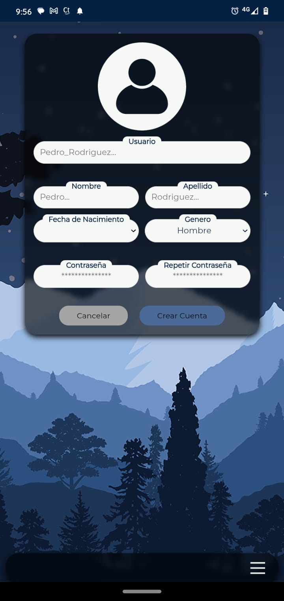

# TANOHA

Tanoha es una aplicación web desarrollada con React.js que permite la gestión eficiente de tareas, notas y hábitos. Su nombre proviene de Tasks, Notes, and Habits (o en español: Tareas, Notas y Hábitos).

  <!--  -->     

## Descripción

Con Tanoha, puedes:

- Gestionar tareas: Crear, programar y marcar tareas como completadas.

- Crear y organizar notas: Almacenar información de manera estructurada.

- Manejar hábitos (Próximamente): Una funcionalidad en desarrollo para ayudarte a construir y mantener hábitos positivos.

- Espacios de trabajo personalizados: Crea múltiples espacios de trabajo con tareas, notas y hábitos independientes para organizar mejor tus proyectos y actividades.

## Características

- Creación y programación de tareas.

- Seguimiento y cumplimiento de tareas.

- Creación y organización de notas escritas.

- Sección de hábitos en desarrollo.

- Múltiples espacios de trabajo personalizados.

## Tecnologías Utilizadas

React.js - Framework principal

React Router - Manejo de rutas

LocalHost - Almacenamiento de datos

## Despliegue

Puedes acceder a la versión en producción en: https://dgosunar.github.io/Tanoha/

## Contribución

Si deseas contribuir al desarrollo de Tanoha, sigue estos pasos:

Realiza un `fork` del repositorio.

Crea una rama con tu nueva característica: `git checkout -b feature-nueva`.

Realiza los cambios y haz un commit: `git commit -m "Agregada nueva funcionalidad"`.

Envía un `Pull Request` para revisión.

<!-- ##  Licencia

Este proyecto está bajo la licencia MIT - consulta el archivo LICENSE para más detalles. -->

## Contacto

Para dudas o sugerencias, puedes contactarme en:

- GitHub: @dgosunar

- Correo Electrónico: dgosunar@gmail.com
